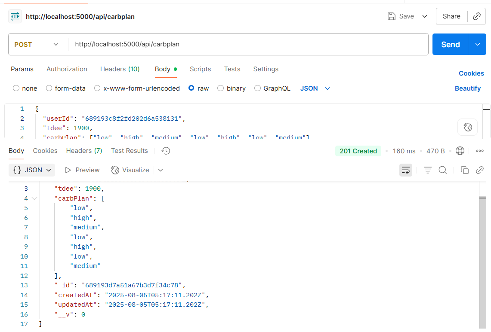

# Test Document

## POST /api/carbplan Testing

**Request:**

**End point**: `POST http://localhost:5000/api/carbplan`
Body:

```
{
  "userId": "689193c8f2fd202d6a538131",
  "tdee": 1900,
  "carbPlan": ["low", "high", "medium", "low", "high", "low", "medium"]
}
```

**Expected**: `201 Created`
**Actual**: `201 Created`
**Response:**

```
{
  "_id": "...",
  "user": "689193c8f2fd202d6a538131",
  "tdee": 1900,
  "carbPlan": [...]
}
```



## GET /api/carbplan/:id Testing

**Endpoint:** `GET http://localhost:5000/api/carbplan/689193c8f2fd202d6a538131`

**Expected:** `200 OK`

**Actual:** `200 OK ✅`

**Returned JSON:**

```
{
  "_id": "...",
  "user": "689193c8f2fd202d6a538131",
  "tdee": 1900,
  "carbPlan": ["low", "high", "medium", "low", "high", "low", "medium"],
  "createdAt": "...",
  "updatedAt": "..."
}
```
